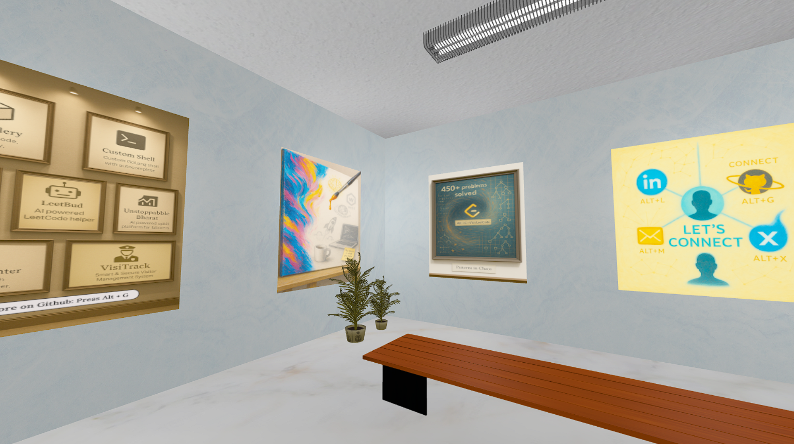

# Portfolio Gallery 🎨🖼️



Welcome to **Portfolio Gallery** — a creative blend of technology and storytelling built with **Three.js** and **Vanilla JavaScript**.

Step into an interactive 3D gallery where each painting tells a part of my story. From projects and experiences to passions and dreams, this portfolio is more than just code — it's a space that reflects who I am.

Get close to a painting in the gallery, and you'll see its story unfold.

---

## 🚀 Features

* 🖼️ 10 unique paintings, each representing a key part of my journey
* 🧭 Free movement within the gallery space
* 🗣️ Interactive storytelling — get close to learn more
* 🌐 Built with **Three.js** for a smooth 3D experience

---

## 🛠️ Tech Stack

* **Three.js** (for 3D rendering)
* **Vanilla JavaScript**
* **Vite** (for fast project setup)

---

## 📦 Getting Started

1️⃣ Clone the repository:

```bash
git clone https://github.com/DebdipWritesCode/
```

2️⃣ Install dependencies:

```bash
npm install
```

3️⃣ Run the project:

```bash
npm run dev
```
---

## 💡 About the Project

This portfolio isn't just about the work I've done — it's about the journey so far, the ideas I’m exploring, and the future I'm building.

From AI and Web3 to public speaking and art, each painting holds a piece of my story.

Feel free to explore, and if an idea resonates with you, let's connect!

---

## ⭐ Show Some Love

If you like this project, please feel free to ⭐ **star** the repo! It means a lot. 🌟